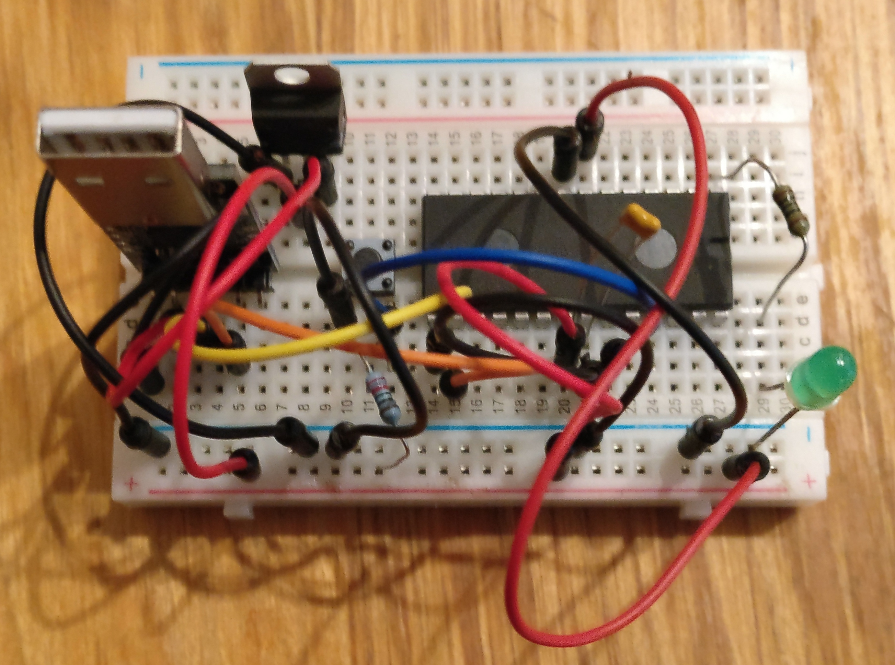

# LPC1114
### FORTH development using LPC1114

#### First, the good news

The nxp LPC1114 is an inexpensive, capable ARM processor.

One variant (the LPC1114FN28/102) comes in a breadboard-friendly 28-pin DIP.

It has 32k bytes of EPROM and 4k bytes of RAM. Its hardware support includes serial communications, I2C and SPI.

It has  6 ADC channels and 22 GPIOs.

It needs no external components, it's easy to program over a serial connection, and its digital inputs are 5v tolerant.

#### Now the bad news

The production of the DIP version of the LPC1114 has stopped, and when current stocks run out the chip will no longer
be available.

[Mouser still has a few](http://www.mouser.co.uk/ProductDetail/NXP-Semiconductors/LPC1114FN28-10212/)
and I found a few other vendors offering it - at a price!

Happily, there are good alternatives; see the [Blue Pill](#bluepill) section below.

### Credits and corrections

I found several descriptions of how to wire it up and program it; they differed slightly, and one or two seem to
contain minor errors. I'll try to describe what I did as accurately as I can and explain the choices I made during
implementation

It's easily programmed using a USB-to-Serial cable, and there is a pre-built FORTH image available.

I'm currently exploring the combination and will document the [hardware construction](hardware.md) and [software installation](software.md) in this GitHub
project.

The project was inspired by two great Hackaday articles, and
an excellent post from Jen-Claud Wippler on his jeelabs site:

[ARMing a Breadboard](http://hackaday.com/2015/10/09/arming-a-breadboard-everyone-should-program-an-arm/)

[Go Forth on a Breadboard](https://hackaday.com/2015/08/30/go-forth-on-a-breadboard/)

[Forth on a DIP](http://jeelabs.org/2015/07/22/forth-on-a-dip/)

### Current status

Here's a picture of my first breadboarded version:

Here's version 2.0, built on one of Adafruit's wonderful Perma-proto boards.

###  Good news part 2 - the *Blue Pill* alternative

You can read about a widely available and inexpensive DIP-friendly ready-made
board with a more powerful ARM chip on the
[jeelabs blog](http://jeelabs.org/article/1649a/).

Like the LPC1114 the chip can be programmed over a serial connection. The board has an FTDI on-board USB-to-serial converter,
so all you need is a USB cable and the appropriate software.

Apparently the board is often referred to as the *Blue Pill*.

It's easy to find at a cost of $2- $3 dollars. Just search for 'stm32f103c8t6 board' on eBay.

As with the LPC1114 there's a mecrisp FORTH image available.
I have some boards on order and will report once I've had a chance to investigate.

