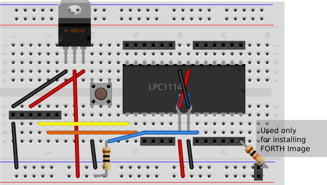
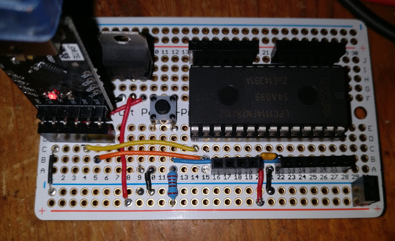

# Hardware construction

## Wiring up the LPC1114 breadboard

Here's a Fritzing diagram of the breadboarded version, laid out as it is on the Perma-proto
board.

Parts list:

1 x LPC1114FN28 MCU
4 x 6-way 0.1" female connector
1 x 4-way 0.1" female connector
1 x 0.1 muF ceramic capacitor
2 x 10 k Ohm resistor*
1 x ST LD1117AV33 3.3 Volt regulator
Hookup wire.

* one 10 k ohm resistor is used only for the initial installation of the FORTH
image - see [software notes](software.md).

Not shown:

CP2102 USB-to-serial converter or FTDI USB-to-TTL Serial Cable.
 
Since the LPC1114's digital inputs are 5v tolerant,
either a 3.3v or 5v FTDI cable should work.

## Perma-proto soldered version

